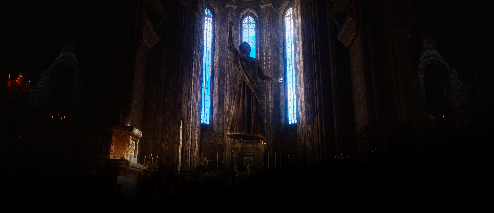

# EdenVerse

EdenVerse là website giới thiệu và quản lý game theo phong cách dark fantasy, gothic và visual novel premium. Trang chủ tập trung vào 3 kệ chính: Game Hot theo lượt click tải, game mới ra mắt và game chất lượng tốt.



## Điểm Chính

- Next.js 15 App Router, React 19, TypeScript, TailwindCSS và Framer Motion.
- Prisma + PostgreSQL với migration production tự chạy trên Vercel.
- NextAuth credentials login bằng email/password, không dùng Google/Discord.
- Không hard-code tài khoản admin production trong source hoặc README.
- Super Admin được tạo bằng `ADMIN_SETUP_TOKEN` bí mật một lần.
- Admin có form đăng game thật vào PostgreSQL, chỉnh giới thiệu trang chủ, xóa bài, xóa game demo và đổi mật khẩu.
- Có rate limit, role check, origin check, bcrypt hash, Zod validation, upload filter và security headers.

## Chạy Local

```bash
npm install
npm run dev
```

Mở [http://localhost:3000](http://localhost:3000).

## Biến Môi Trường

Copy file env:

```bash
copy .env.example .env
```

Biến quan trọng:

- `DATABASE_URL`: PostgreSQL production hoặc local.
- `DATABASE_URL_UNPOOLED`: URL direct/unpooled cho migration trên Vercel nếu có.
- `AUTH_SECRET`: chuỗi bí mật mạnh cho NextAuth.
- `ADMIN_SETUP_TOKEN`: token bí mật chỉ dùng để bootstrap Super Admin lần đầu.
- `ENABLE_DEMO_AUTH`: chỉ bật `true` cho local demo, không bật production.
- `ENABLE_PRISMA_DEMO_FALLBACK`: bật/tắt game fallback demo.
- `NEXT_PUBLIC_SITE_INTRO`: câu giới thiệu mặc định trước khi admin lưu setting.

## PostgreSQL / Prisma

```bash
docker-compose up -d postgres
npm run db:generate
npm run db:migrate
npm run db:seed
```

Trên Vercel, `npm run build` sẽ tự chạy `prisma generate` và `prisma migrate deploy` khi có `VERCEL=1` và `DATABASE_URL`.

## Admin Production

Không có mật khẩu admin mặc định. Quy trình đúng là:

1. Tạo `ADMIN_SETUP_TOKEN` mạnh trong Vercel.
2. Deploy.
3. Gọi `POST /api/admin/bootstrap` với token bí mật để tạo Super Admin.
4. Gỡ `ADMIN_SETUP_TOKEN` và redeploy để khóa bootstrap.
5. Đăng nhập bằng tài khoản Super Admin thật và đổi mật khẩu trong `/admin`.

## Routes Chính

- `/`: trang chủ với 3 kệ game chính.
- `/games/hot`: Game Hot theo lượt click tải.
- `/games/new`: game mới ra mắt.
- `/games/quality`: game chất lượng tốt.
- `/games/[slug]`: chi tiết game.
- `/search`: tìm kiếm và lọc game.
- `/admin`: quản trị game, nội dung, bảo mật và SEO.
- `/auth/login`: đăng nhập email/password.

## API Chính

- `GET /api/games`
- `POST /api/games/[slug]/download`
- `POST /api/admin/bootstrap`
- `POST /api/admin/games`
- `POST /api/admin/password`
- `POST /api/admin/settings`
- `GET|DELETE /api/admin/posts`
- `POST /api/upload`

## Background

Ảnh nền chính nằm tại `public/backgrounds/eden-cathedral.png` và được dùng xuyên suốt website với blur nhẹ, overlay tối, vignette, ánh xanh kính cathedral, fog và particles nhẹ.
